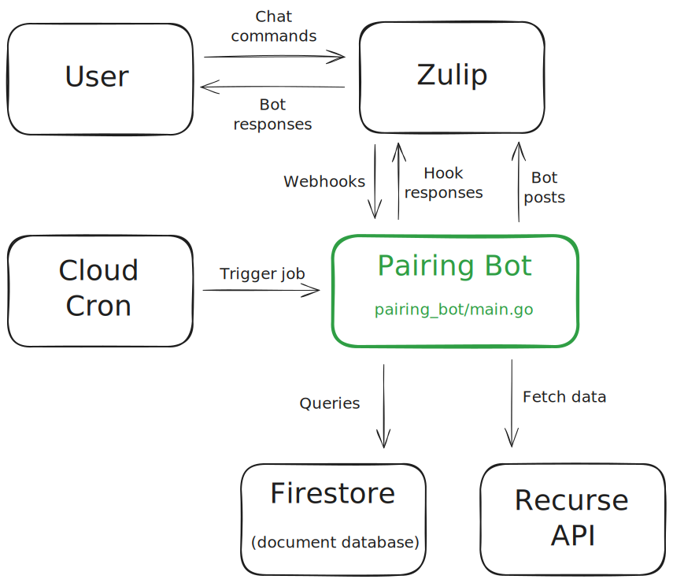

# Pairing Bot :pear::robot:

A Zulip bot that partners people for pair programming practice :)

## Information for Pairing Bot users

Pairing Bot interacts through private messages on [Zulip](https://zulipchat.com/):

* `subscribe` to start getting matched with other Pairing Bot users for pair programming
* `schedule monday wednesday friday` to set your weekly pairing schedule
  * In this example, Pairing Bot has been set to find pairing partners for the user on every Monday, Wednesday, and Friday
  * The user can schedule pairing for any combination of days in the week
* `skip tomorrow` to skip pairing tomorrow
  * This is valid until matches go out at 04:00 UTC
* `unskip tomorrow` to undo skipping tomorrow
* `status` to show your current schedule, skip status, and name
* `unsubscribe` to stop getting matched entirely
  * This removes the user from the database. Since logs are anonymous, after **unsubscribe** Pairing Bot has no record of that user
* `add-review` to add a publicly viewable review to help other users learn about Pairing Bot.
* `get-reviews` to view the 5 most recent reviews for Pairing Bot. You can pass in an integer param to specify the number of reviews to get back.
* `cookie` to get the most amazing cookie recipe!

## Information for Pairing Bot admins

### Deploys

* Runs in [GCP](https://cloud.google.com/) on [App Engine](https://cloud.google.com/appengine/docs/standard/)
* Uses [Firestore](https://cloud.google.com/firestore/docs/) for its database
* Deployed on pushes to the `main` branch with [Cloud Build](https://cloud.google.com/cloud-build/docs/)
* Onboarding, offboarding, and daily pairing matches are all controlled with cron jobs set in [Cloud Scheduler](https://cloud.google.com/scheduler).

### Configuration

The database must be pre-populated with some data:

1. A Zulip shared secret ("authentication token") used to validate incoming requests from Zulip
2. A Zulip API key used to talk to the Zulip API as the Pairing Bot Zulip user
3. A Recurse Center API key used to fetch RC data

Zulip bots must have an owner set in Zulip and may only have one owner at a time. RC Pairing Bot's ownership is given to whoever is working on Pairing Bot at the moment. The current owner is [Jeremy Kaplan].

## Information for People Looking to Work On Pairing Bot

Please contact [Charles Eckman], [Jeremy Kaplan], and/or [Maren Beam] for help getting started. You'll get an overview of Pairing Bot's code and commit access to this repo. You'll also get a tour of the Google Cloud project and access to the resources in it.

You can open a Pull Request for Pairing Bot without contacting the project owners, but that means you'll lose out on the testing environment described below!

### The Testing Environment

Pairing Bot has a test environment where you can validate your changes before changing the main Pairing Bot. It consists of:
* A separate Zulip Bot (Pairing Bot (Test Version)) that you can send commands to.
* A separate GCP Project with its database, logging and cron job setup.
* A `dev` branch in GitHub that automatically deploys pushed changes to the GCP project.

#### How to Make Changes to Pairing Bot

1. Contact one of the maintainers of Pairing Bot to learn about the project and gain project permissions.
2. Make your code changes on the `dev` branch and push to this GitHub repo.
3. Check the CloudBuild tab in Google Cloud to make sure that the Pairing Bot project built successfully.
4. Test out your changes with the Pairing Bot (Test Version)
5. Check the Logs in Google Cloud to make sure your change did not introduce any errors.
6. If everything looks good, you can open up a Pull Request comparing `dev` against `main`. If you have Git permissions from the maintainers then feel free to merge your changes in!

**Pull requests are welcome, especially from RC community members!**

Pairing Bot is an [RC community project](https://recurse.zulipchat.com/#narrow/stream/198090-rc-community.20software).

**Your contributions are welcome and encouraged, no matter your prior experience!**

[Jeremy Kaplan]: https://www.recurse.com/directory/6151-jeremy-kaplan
[Charles Eckman]: https://www.recurse.com/directory/6134-charles-eckman
[Maren Beam]: https://www.recurse.com/directory/2907-maren-beam
